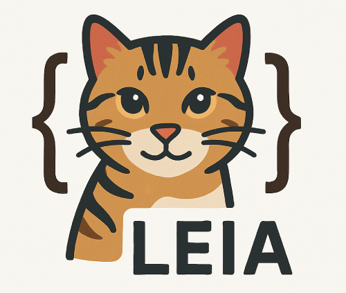

# leia-lang

A programming language made for educational purposes, named after my cat.

## VM Instruction Set

I don't really know what I'm doing, so I'm just going to build up an instruction set as I see fit.

| Instruction   | Description                          |
| ------------- | ------------------------------------ |
| PUSH_CONST x  | Push constant x onto the stack       |
| POP           | Remove top value from stack          |
| ADD           | Add top two values                   |
| SUB           | Subtract top two values              |
| MUL           | Multiply top two values              |
| DIV           | Divide top two values                |
| LOAD_LOCAL n  | Push value from variable slot n      |
| STORE_LOCAL n | Store top value into variable slot n |
| JMP addr      | Unconditional jump to address        |
| JZ addr       | Jump if top of stack is zero         |
| JNZ addr      | Jump if top of stack is not zero     |
| EQ            | Compare equality of top two values   |
| LT            | Compare if second < first            |
| GT            | Compare if second > first            |
| PRINT         | Prints top value                     |
| HALT          | Stop execution                       |
